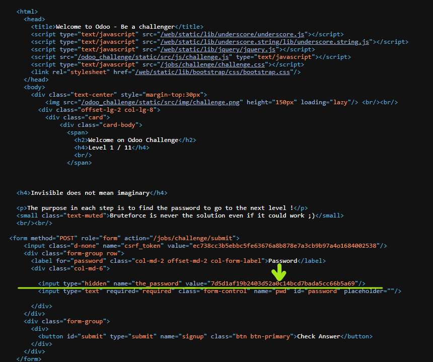

# Test - 1  
[Back to home](../readme.md)  
## To pass the first test simply display the page source and find the hidden field.  
## If you are a using Google Chrome, you can view the page source by Ctrl+U.  
  
[Back to home](../readme.md)  
