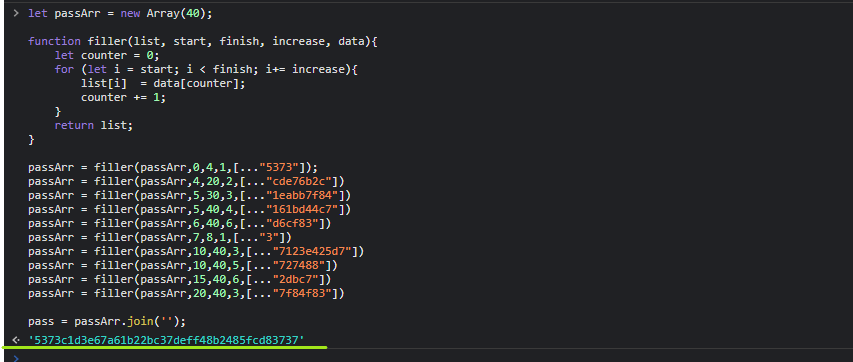

# Test - 10  
[Back to home](../readme.md)  
##  In the test we see a function that returns items from the selected array according to the range and increment arguments.  
## The following code can be used to combine cipher snippets that are given piecemeal.  
  
[Back to home](../readme.md)
