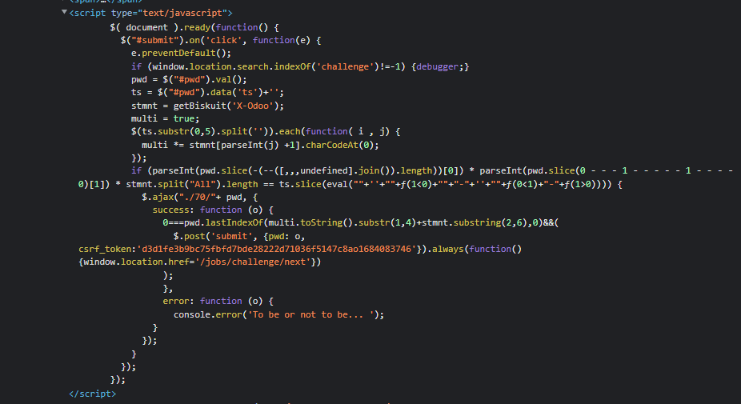
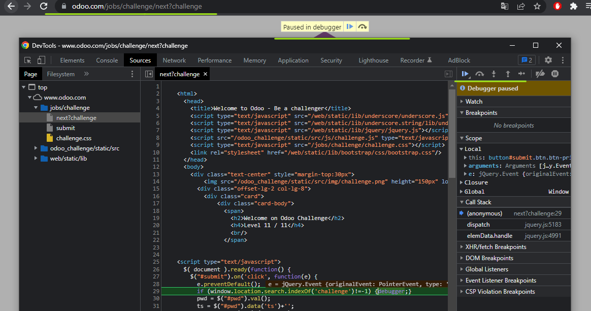
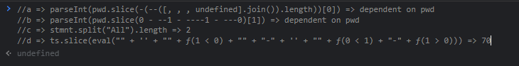
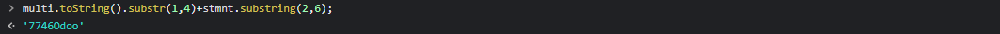
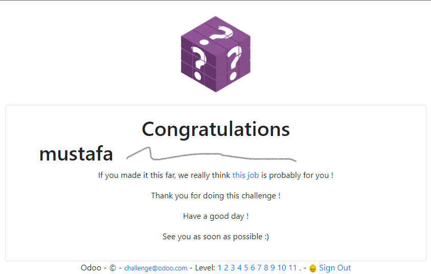

# Test - 11  
[Back to home](../readme.md)  
##  By checking the source code, you can find the script that will run when the "Check Answer" button is pressed.  
  
## According to the first condition, if you write a query with "challenge" in the URI, you can use the browser's debugger feature.  
  
## The second condition is in the form a * b * c == d.  
## With the help of the debugger, it can be seen that c = 2, d = 70.  
  
## So a * b must be 35.  
## Examining a and b reveals that these are the last two digits of the password, so the password must end with 57 or 75 to satisfy the condition.  
## In the last condition, as you can see in the picture below, the password must start with 7746Odoo.  
  
## The password can be either 7746Odoo57 or 7746Odoo75. Choose your side.  
  
[Back to home](../readme.md)
