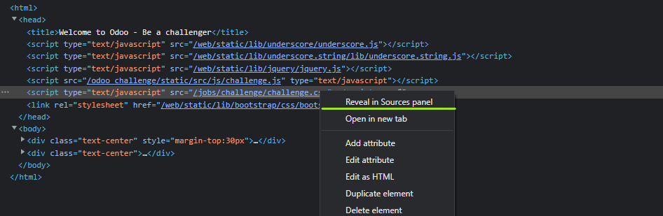
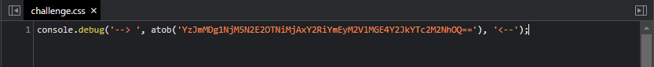
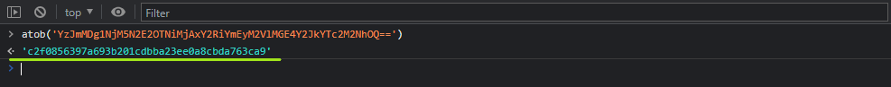
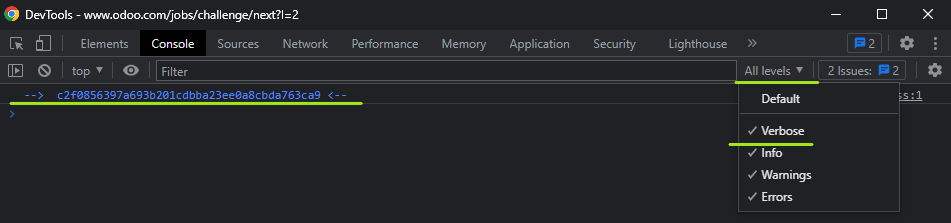

# Test - 2  
[Back to home](../readme.md)  
## In order to pass the second test, we need to use the browser's developer tools.  
## If you are using Google Chrome, you can view the page source by Ctrl+Shift+I or F12 key.  
## When we examine the source code from the reveal tab, there are a scripts named challenge.css in the header.  
## Let's see what is written in them by Right Click > Reveal in Sources Panel.  
  
## Here we found the hidden message.  
  
## When we run the atob function in the console with the argument written in the message, it gives us the password,  
  
## or by changing the log level of the console we can see the message  
  
[Back to home](../readme.md)
