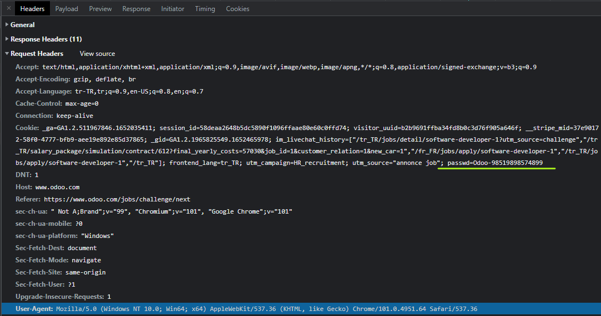
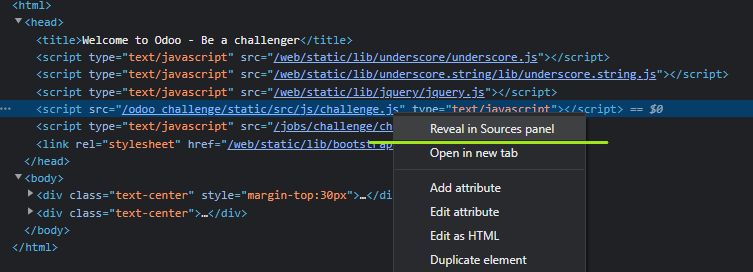
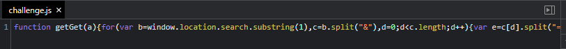
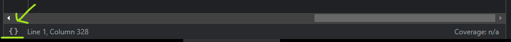
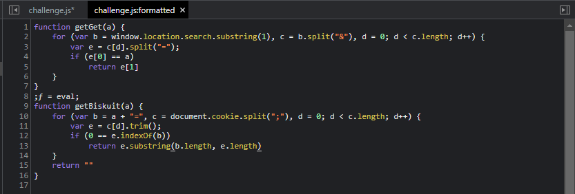
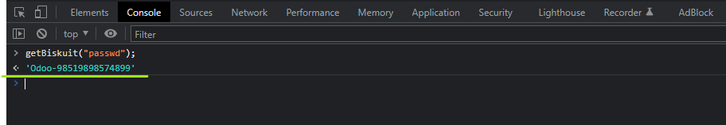

# Test - 5  
[Back to home](../readme.md)  
## We look at the cookies, paying attention to the cookie picture that is the clue, and there we find the password.  
  
## In addition, when the files included in the header are examined, there is a script called challenge.js. When we examine the content by clicking Reveal in Source Panel, we encounter a minified code.  
   
  
## Browsers have very advanced and useful features. So we don't need to worry about minified code.  
## If you are a Google Chrome user, find the { } button at the bottom left.  
  
## It's a formatter button and can make the code more readable.  
  
## Now the code is much more readable. There is a function called getBiscuit here. This script returns the value of a field in the cookie. We can copy the password directly from the place in the first picture, but if we run the code getBiscuit("passwd") on the console, it will also give us the password.  
  
[Back to home](../readme.md)
