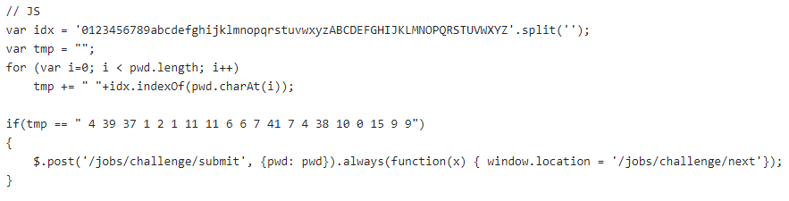
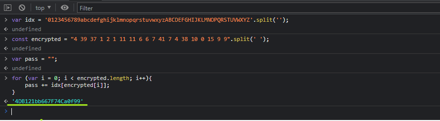

# Test - 6  
[Back to home](../readme.md)  
## This is a simple encryption code  
  
## The password can be found by writing a simple code that reverses the process.  
  
[Back to home](../readme.md)
