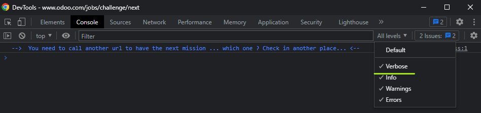
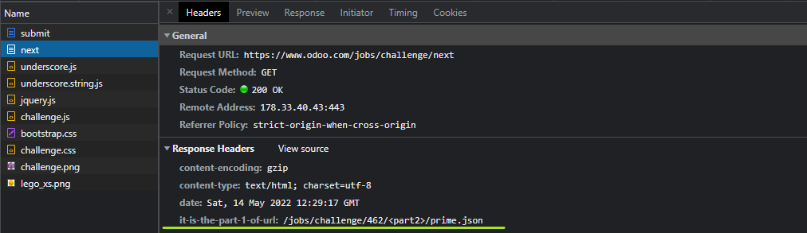
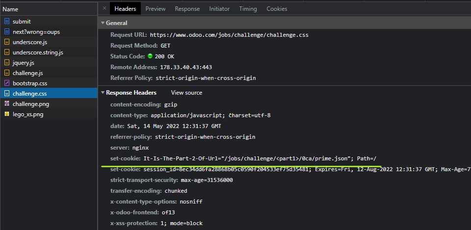
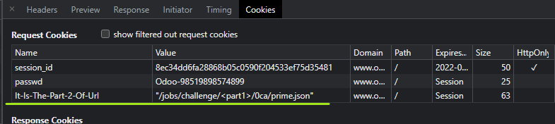
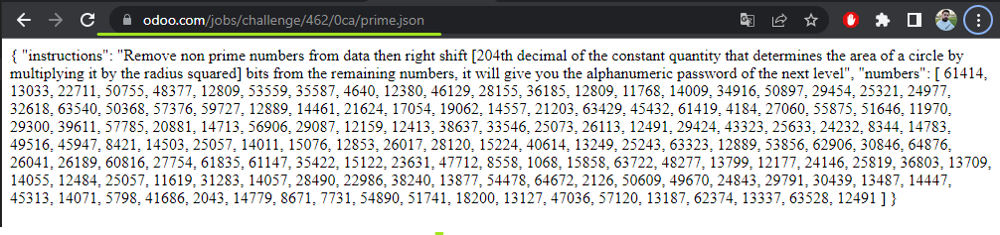
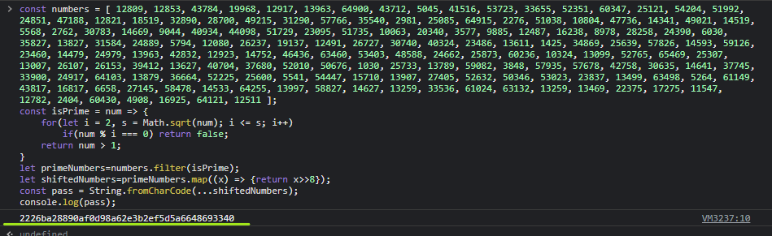

# Test - 7  
[Back to home](../readme.md)  
## If the console is displaying messages at all levels, you can see the hint on console.  
  
## When we examine the headers in the Network tab, we can find both parts of the url.  
  
  
  
## When we combine the URL and go to the link, we encounter the following message.  
  
## The expression in parentheses is the definition of the number pi and its 204th decimal is 8.
## We can find the password by running the following code in the console.  
  
[Back to home](../readme.md)
