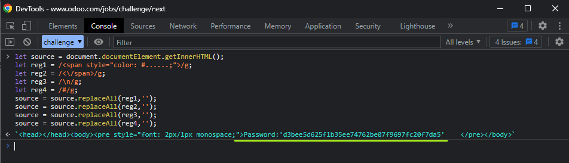

# Test - 8  
[Back to home](../readme.md)  
## When the source code is examined, it is understood that the cube figure on the question was created with # character. But it seems that there are other characters in the code as well.  
## HTML codes, css codes, # characters and new line characters made it difficult for us to see other characters.  
## Let's get rid of them with the help of the following regex expressions and the replace function.  
  
[Back to home](../readme.md)
