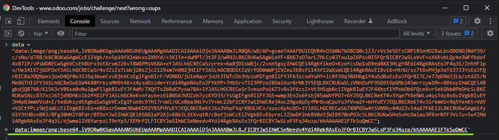
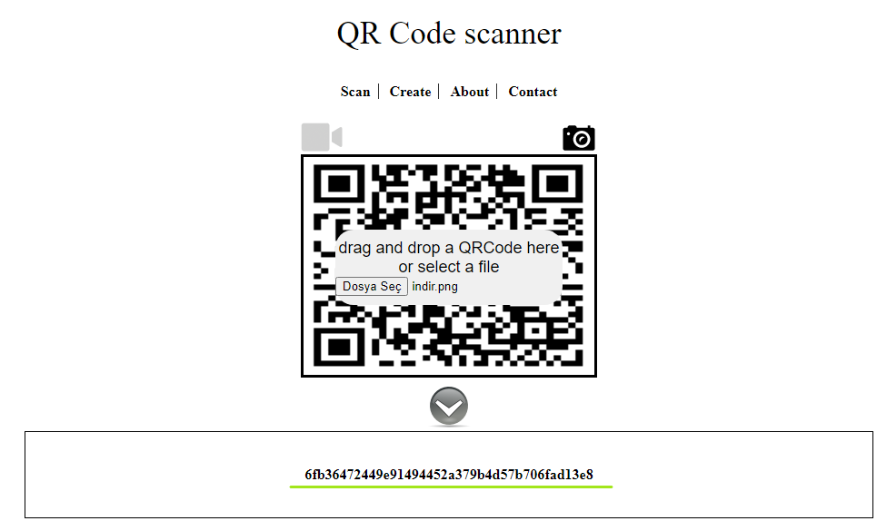

# Test - 9  
[Back to home](../readme.md)  
## There is a string of characters that seems meaningless and odoo gave us 'png' as a clue. So this could be the data of a png image.  
##  Assuming that the part inside the quotes is data and the file format is png, combine "data:image/png;base64," with the data from the homepage.  
  
## When clicking on it to view the resulting image, a qr code is encountered.  
  
## You can find the password information in the QR code.  
  
[Back to home](../readme.md)
